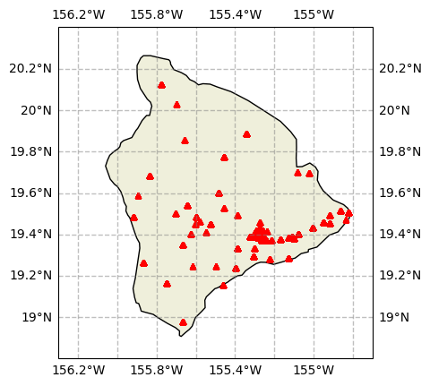
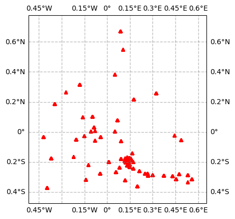

# Rotate Receiver Locations by a Given Angle

## Command `surfatt_rotate_src_rec`

The `surfatt_rotate_src_rec` command is used to rotate the location of sources and receivers by a given angle. The command is called as follows:

```{code-block} console
 Usage: surfatt_rotate_src_rec -i src_rec_file -a angle [-o out_src_rec_file]
 
 Rotate source and receiver locations by a given angle (anti-clockwise)
 
 required arguments:
  -i src_rec_file      Path to src_rec file in csv format
  -a angle             Angle in degree to rotate source and receiver locations
  -c clat/clon         Center of rotation in latitude and longitude
 
 optional arguments:
  -o out_file          Output file name, defaults to src_rec_file "_rot" appended
```

The `surfatt_rotate_src_rec` command reads the source and receiver locations from the input file `src_rec_file` and rotates them by the given angle `angle` (in anti-clockwise degrees) about the center of rotation `clat/clon`. The rotated source and receiver locations are written to the output file `out_src_rec_file`. If the output file is not specified, the rotated source and receiver locations are written to a file with the name `src_rec_file` appended with `_rot`.

## Example

In the following example, the source and receiver locations are rotated by `-30` degrees about the center of rotation `(19.5, -155.5)` and written to the output file `src_rec_file_rotated.csv`. To illustrate this example, we use Jupyter Notebook to invoke the `surfatt_rotate_src_rec` command, and plot the original and rotated source and receiver locations.

:::{note}
This Jupyter Notebook example can be found [here](https://github.com/xumi1993/SurfATT/blob/surfker/examples/rotation/rotation.ipynb).
:::

First, we import the required Python packages:

```{code-block} python
import pandas as pd
import matplotlib.pyplot as plt
import cartopy.crs as ccrs
import cartopy.feature as cfeature
```

A function to plot the source and receiver locations is defined as follows:

```{code-block} python
def plot_basemap(region, feature=True):
    fig = plt.figure()
    ax = fig.add_subplot(1, 1, 1, projection=ccrs.Mercator())
    ax.set_extent(region, crs=ccrs.PlateCarree())
    gl = ax.gridlines(crs=ccrs.PlateCarree(), draw_labels=True,
                      linewidth=1, color='gray', alpha=0.5, linestyle='--')
    if feature:
        ax.coastlines()
        # plot land
        ax.add_feature(cfeature.LAND)
    return ax
```

Next, we read the source and receiver locations from the input file `src_rec_file.csv` and plot them:

```{code-block} python
sr = pd.read_csv('src_rec_file.csv')
ax = plot_basemap([-156.3, -154.7, 18.8, 20.4])
ax.plot(sr['stlo'], sr['stla'], 'r^', markersize=5, transform=ccrs.PlateCarree())
```



The source and receiver locations are then rotated by `-30` degrees about the center of rotation `(19.5, -155.5)` and written to the output file `src_rec_file_rotated.csv`:

```{code-block}
! surfatt_rotate_src_rec -i src_rec_file.csv -a -30 -c 19.5/-155.5 -o src_rec_file_rotated.csv
```

Finally, we read the rotated source and receiver locations from the output file `src_rec_file_rotated.csv` and plot them:

```{code-block} python
sr_rotated = pd.read_csv('src_rec_file_rotated.csv')
minx = sr_rotated['stlo'].min()
maxx = sr_rotated['stlo'].max()
miny = sr_rotated['stla'].min()
maxy = sr_rotated['stla'].max()
marginx = (maxx - minx) * 0.1
marginy = (maxy - miny) * 0.1
region = [minx - marginx, maxx + marginx, miny - marginy, maxy + marginy]
ax = plot_basemap(region, feature=False)
ax.plot(sr_rotated['stlo'], sr_rotated['stla'], 'r^', markersize=5, transform=ccrs.PlateCarree())
```

